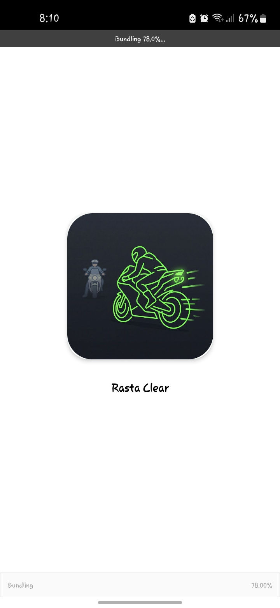
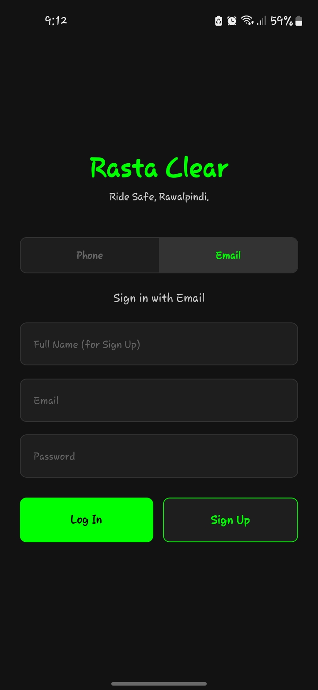
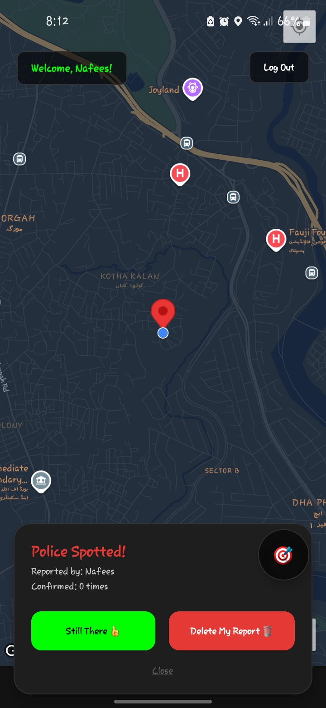

# Rasta Clear 🚴‍♂️🚓

**Rasta Clear** is a community-driven, real-time proximity alert app designed for riders. It allows users to report and avoid traffic police locations by dropping pins on a live map. With haptic feedback, voice alerts, and community-verified data, Rasta Clear keeps you informed and safe on the road.

---

## 🚀 Features

- **Real-Time Map & Tracking**: Live GPS tracking using an immersive dark-mode map.
- **Proximity Alerts**: Voice warnings (Text-to-Speech) and haptic vibrations when approaching within 500 meters of a reported pin.
- **Smart Cooldown**: Intelligent 2-minute cooldowns between alerts to prevent spamming while waiting at signals.
- **Community Moderated**: Pins rely on crowdsourced verification. Pins get removed automatically after receiving 3 "Clear" or "Not There" reports.
- **Ephemeral Data**: Pins auto-expire after 2 hours to ensure the map stays relevant and clutter-free.
- **Follow Mode**: Keep the map centered on your location as you ride.

---

## 📸 Screenshots

| Loading Splash | Auth Screen | Live Map & Alert |
| :---: | :---: | :---: |
|  |  |  |

---

## 🛠 Tech Stack

- **Frontend**: React Native (Expo)
- **Backend/Database**: Firebase (Firestore Real-time DB, Firebase Auth)
- **Maps**: `react-native-maps`
- **Sensors & APIs**: `expo-location`, `expo-speech`, `expo-haptics`

---

## 💻 How to Run Locally

### Prerequisites
- Node.js (v18+)
- Expo CLI
- Firebase Account (for setting up your own database)

### Setup Instructions

1. **Clone the repository:**
   ```bash
   git clone https://github.com/yourusername/rasta-clear.git
   cd rasta-clear
   ```

2. **Install dependencies:**
   ```bash
   npm install
   ```

3. **Set up Firebase Environment Variables:**
   Create a `.env` file at the root of the project and add your Firebase credentials:
   ```env
   EXPO_PUBLIC_FIREBASE_API_KEY=your_api_key
   EXPO_PUBLIC_FIREBASE_AUTH_DOMAIN=your_auth_domain
   EXPO_PUBLIC_FIREBASE_PROJECT_ID=your_project_id
   EXPO_PUBLIC_FIREBASE_STORAGE_BUCKET=your_storage_bucket
   EXPO_PUBLIC_FIREBASE_MESSAGING_SENDER_ID=your_messaging_sender_id
   EXPO_PUBLIC_FIREBASE_APP_ID=your_app_id
   ```

4. **Start the application:**
   ```bash
   npx expo start
   ```
   Scan the QR code with the Expo Go app on your physical device, or run it on an iOS Simulator/Android Emulator.

---

## 📲 Download the APK

Want to try it out on your Android device right away? 
**[Download the latest APK here](https://github.com/justnefo-debug/RastaClear/releases/download/v1.0.0/app-release.apk)**

---

## 🤝 Contributing
Contributions, issues, and feature requests are welcome! Feel free to check the [issues page](#) if you want to contribute.
